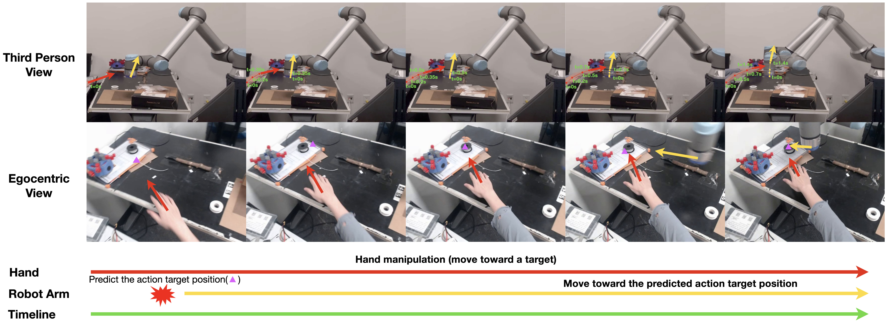

# [EgoPAT3Dv2: Predicting 3D Action Target from 2D Egocentric Vision for Human-Robot Interaction](https://ai4ce.github.io/EgoPAT3Dv2/).

[Irving Fang](https://irvingf7.github.io/)\*, [Yuzhong Chen](https://github.com/yuzhongchen/)\*, [Yifan Wang]()\*, [Jianghan Zhang]()\+, [Qiushi Zhang]()\+, [Jiali Xu]()\+, [Xibo He](), [Weibo Gao](), [Hao Su](), [Yiming Li](https://yimingli-page.github.io/), [Chen Feng](https://scholar.google.com/citations?user=YeG8ZM0AAAAJ)


## Project Website
Please visit [our project website](https://ai4ce.github.io/EgoPAT3Dv2/) for more information, such as a **video presentation**.


## Environment Setup
The project was developed on `Python 3.11.5` and `PyTorch 2.1.1` with `CUDA 11.8.0` binaries. For more details about the required packages, please take a look at `requirements.txt`


## Dataset
Please visit our [Hugging Face repo](https://huggingface.co/datasets/ai4ce/EgoPAT3Dv2/tree/main) to access and prepare the dataset.

## Training
We used the configuration files in `configs` to control the hyperparameters during our experiments. For more details on the hyperparameters, please refer to the [README](./configs/README.md) for configuration files.

To train a model with specified hyperparameters, please run
```
python train_DDP.py --config_file [your configuration file]
```

**Note:** Our training code is written for distributed training on NYU HPC with `PyTorch DDP` and `singularity` container. Please modify the `train_DDP.py` code to suit your needs. You can refer to the `train.SBATCH` file for more info on our distributed training setup.

## Testing
We used the configuration files in `configs` to control the hyperparameters during our experiments. For more details on the hyperparameters, please refer to the [README](./configs/README.md) for configuration files.

To test a model with specified hyperparameters, please run
```
python test_DDP.py --config_file [your configuration file]
```

**Note:** Slightly different from the training code, our testing code is written for single-card inference. Similarly, you can check out the `test.SBATCH` file for more info on our HPC testing setup.

### Testing Results Visualization
To produce aggregated results similar to what's presented in Table I of the paper, please run
```
python eval.py --model_name [model name in the config file]
```

You can also use the `--mode` parameter to dictate whether the test results are created for the seen or unseen test set.

**Note:** We are currently updating this file.